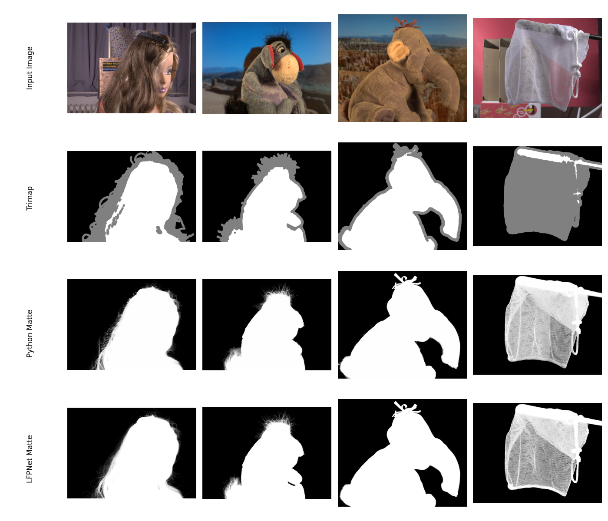
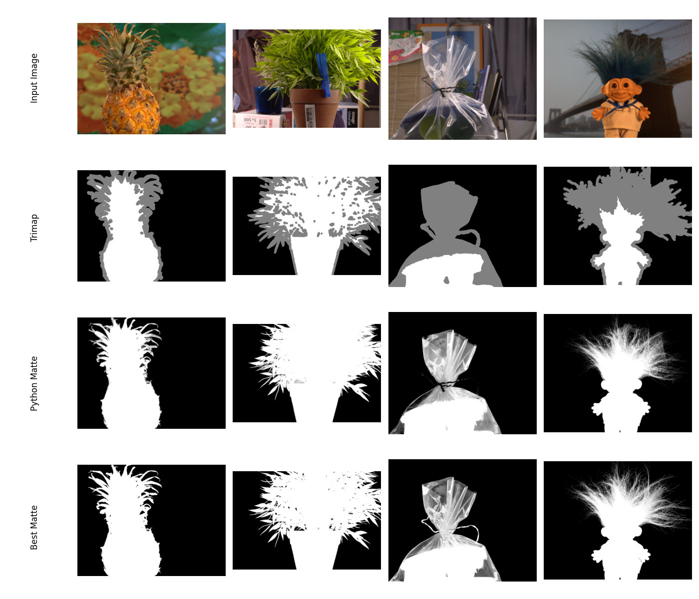

# Three Layer Graph Alpha Matting in Python

This repository contains a Python implementation of the paper "Three-layer graph framework with the sumD feature for alpha matting" [[1]](#1) as part of my project work at Heinrich-Heine-University Duesseldorf.

## Getting Started

### Requirements

* numpy  >= 2.0.0
* pillow >= 10.3.0
* numba  >= 0.60.0
* scipy  >= 1.14.0

To install these dependencies, you can create a new virtual environment and then install them there via the following code:

```bash
python -m venv env

.\env\Scripts\activate

pip install numpy pillow numba scipy
```

### Example usage

```bash
git clone https://github.com/NicoN2310/three-layer-graph-alpha-matting-python

cd three-layer-graph-alpha-matting-python

python run_matting.py
```

This will take the input image and trimap and generate the alpha matte and the resulting cutout. Paths of the files can be set in [run_matting.py](run_matting.py).

## Trimap Construction

To use the underlying alpha matting algorithm you need a trimap. A trimap is a mask for the image, roughly classifying it into three areas:

* __Foreground:__ Pixels of value __255__ - these pixels will always be included, use it to mark areas where you are sure that they belong to the image part you want to extract
* __Background:__ Pixels of value __0__ - these pixels will always be ignored, use it to mark areas where you are sure that they do not belong to the image part you want to extract
* __Uncertain:__ Pixels of value __128__ - these pixels indicate the "border" region between background and foreground. The alpha matting algorithm will estimate here which pixels belong to the foreground and background.

To create such trimaps for your own images you can use image editing tools like the [GIMP](https://www.gimp.org/downloads/) or you could use the [interactive tool](https://github.com/pymatting/pymatting-interactive-tool) from the [PyMatting Library](https://github.com/pymatting/pymatting).

## Evaluation

I tested my implementation using the images from the [Alpha Matting Evaluation Website](https://www.alphamatting.com) [[2]](#2). 

Since the ground-truth is unkown, I used the images from the best implementation (as of 01.07.2024, regarding MSE) called [LFPNet](https://arxiv.org/abs/2109.12252). As the trimap, I used the first trimap called "small" from the website.

Below you can find the results of the Python implementation & the LFPNet matte. Furthermore, you can find the comparison between the authors matte and the Python implementation matte in regard to LFPNet described as MSE errors. You can find the MSE calculation function in this [file](mse_calculation.py).



|        | Doll  | Donkey | Elephant | Net   | Pineapple | Plant | Plasticbag | Troll |
|--------|-------|--------|----------|-------|-----------|-------|------------|-------|
| Own Python Implementation | 0.315 | 0.333  | 0.084    | 1.113 | 0.499     | 0.853 | 2.317      | 0.492 |
| Implementation by Li et al. | 0.382 | 0.281  | 0.045    | 1.066 | 0.539     | 0.626 | 2.208      | 0.487 |



## License

This project is licensed under the MIT License - see the [LICENSE](LICENSE) file for details. Many thanks to the authors of the original paper for allowing me to publish my code this way!

## References

<a id="1">[1]</a>
Chao Li, Ping Wang, Xiangyu Zhu, Huali Pi, Three-layer graph framework with the sumD feature for alpha matting, Computer Vision and Image Understanding, Volume 162, 2017, Pages 34-45, ISSN 1077-3142

<a id="2">[2]</a>
Christoph Rhemann, Carsten Rother, Jue Wang, Margrit Gelautz, Pushmeet Kohli, Pamela Rott. [A Perceptually Motivated Online Benchmark for Image Matting](http://www.ims.tuwien.ac.at/publications/tuw-180666). Conference on Computer Vision and Pattern Recognition (CVPR), June 2009.